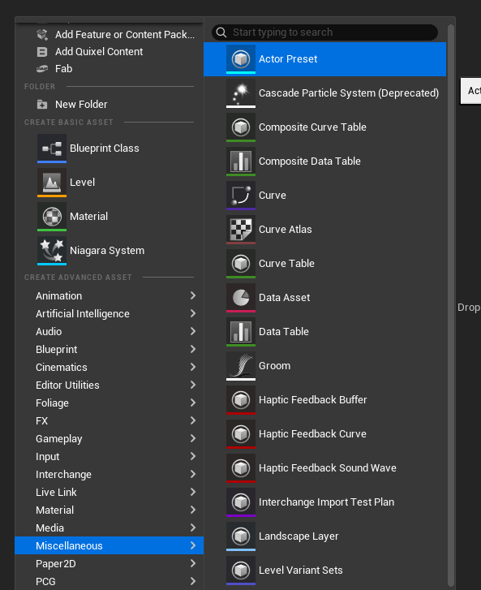
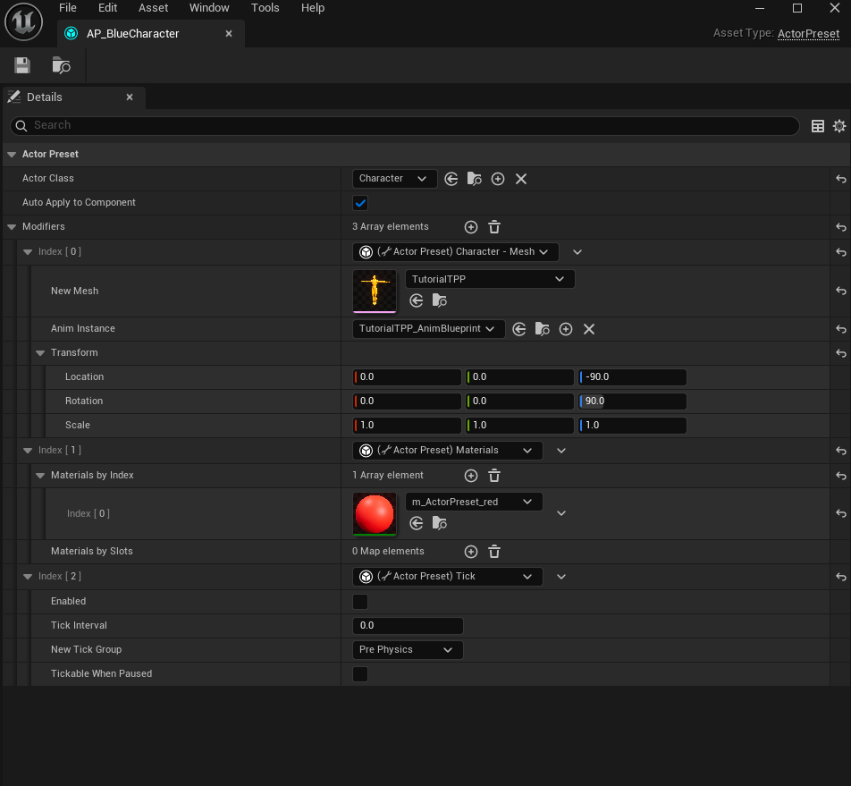
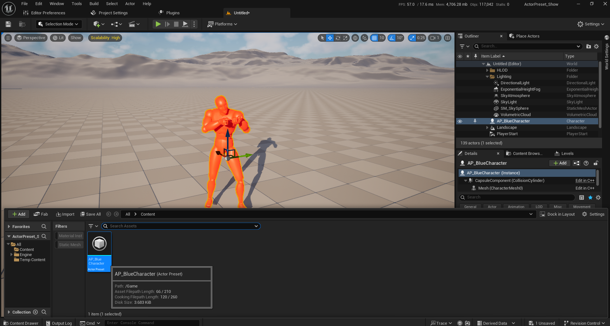
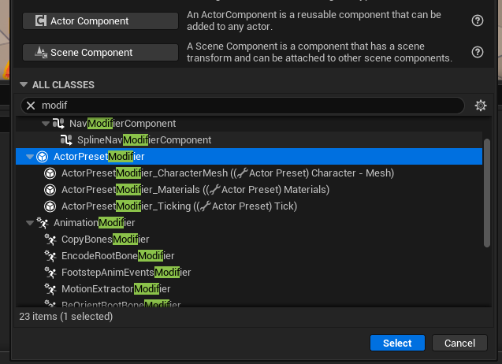
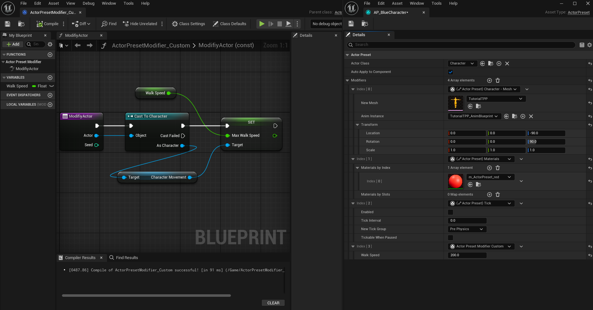
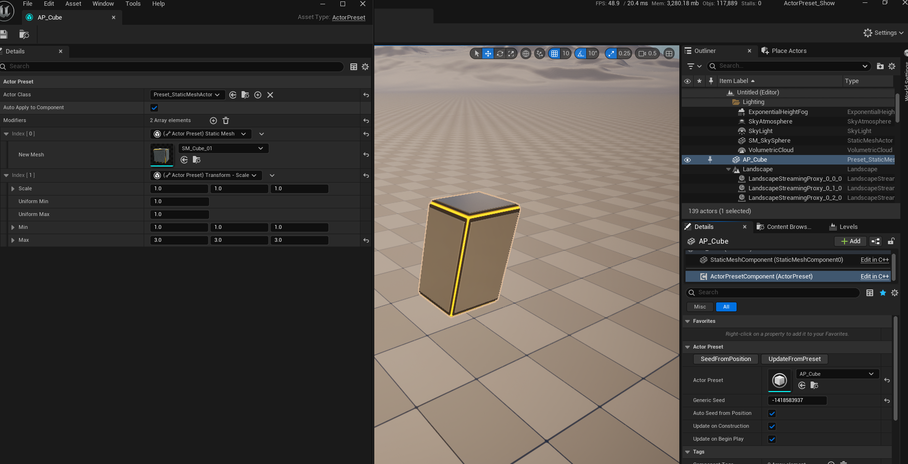

## HOW TO USE

#### Create an Actor Preset

* Go into misc and select Actor Preset to create a new one.

* In the asset preset, select the base class for this preset to use.
* Add in post-creation scripts to modifiy this actor.

* Finally, drag and drop your actor into the world as many times as you want!

#### Actor Preset Scripts
`Actor Preset scripts` let you customize the post-drop-in-world modifications to an actor. You can create a new one from the blueprint menu.

#### Actor Preset Component

The `Actor Preset Component` lets you store a preset on an actor, automatically updating them along with changes to the preset. Additionally, it gives you a seed (either directly set or generated for the world location) to randomize & customize instances of an actor preset. 
